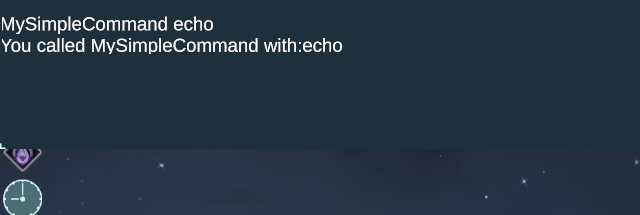

# Adding a console command

## Version Compatibility

Tested on 0.3.29

## Motivation

Debug console is a useful tool for the mod developers to simulate a variety of
situations they may want to test. Most of vanilla entities have console commands
which can manipulate with them. When mod add new entities, it can be extremely
useful to add new console command hooks.

## Background

`TerminalController` is a class responsible for handling the debug console. It
allows registering new command handlers with `RegisterCommand`. Each
registration must supply a string representing the command (what user will type
in the console), `CommandHandler` object and a help string for the command.
`CommandHandler` is a simple delegate object that wraps a handler method.
Handler method must return `void` and accept `string[]` as its argument - that
represents the arguments supplied to the command. The handler object should
preserve a reference to the `TerminalController` to be able to write to console.

## Recipe

Below we will follow an example of adding a simple command that echoes back the
first argument it received.

* Define a holding class for your command handler

```C#
    public class TerminalCustomCommandBinding {
        public TerminalCustomCommandBinding(TerminalController terminalController) {
            this.terminalController = terminalController;  // Save the reference to the controller
            this.terminalController.RegisterCommand(
                "MySimpleCommand",  // The command to be typed into the console
                new CommandHandler(this.MySimpleCommand),  // the holder object for the command handler
                "MySimpleCommand is an exmple of the a custom console command," +  // Help string
                " prints back one argument it is give");
        }

        // Handler for the command, will be called when you type your command with arguments
        // to the console and hit enter.
        public void MySimpleCommand(string[] args) {
            // Check amount of the supplied argument. Our example require at least one argument
            if (args.Length < 1) {
                // Print to console an error
                this.terminalController.OutputError("MySimpleCommand requires one argument");
                return;
            }
            // Print to console some regular text.
            this.terminalController.Output("You called MySimpleCommand with: " + args[0]);
        }

        // A reference to the console controller object.
        private TerminalController terminalController;
    }
```

* The registration of the console command can happen at any time, but it is
  convenient to do in the entry point of the mod.
* Add a holder field for your handler and registration to you mod entry point.

```C#
        public static TerminalCustomCommandBinding terminalBindingHolder;
        //...
        static bool Load(UnityModManager.ModEntry modEntry) {
        //...
            var container = GlobalInstaller.container;
            var terminalController = container.Resolve<Terminal>().controller;
            terminalBindingHolder = new TerminalCustomCommandBinding(terminalController);
        }
```

### Result



### Example

[Complete example code](src/ExampleConsoleCommand.cs)
