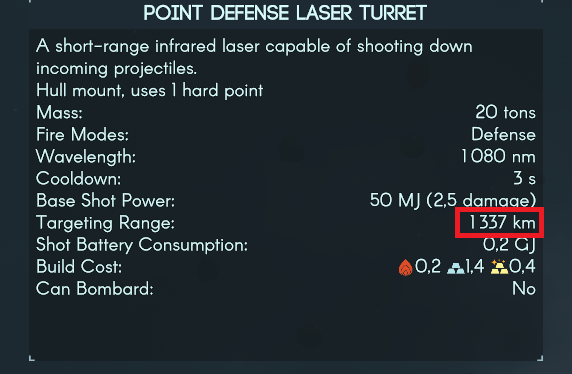

# Patching data templates in code

## Version compatibility

Tested on 0.3.26

## Motivation

The in-game built-in json merger has some behavioural problems - it requires
game restart after enabling to take an effect, but more annoyingly, the list
merge behaviour - indices-wise entry merges - might be not desiarable, e.g. one
can not easily and in a cross-mod-compatible way extend an array field of a
data template. In-code patching of data templates can help avoud the problem.

## Background

`PavonisInteractive.TerraInvicta.TemplateManager` (further referred to as
`TemplateManager`) iterates over `\TerraInvicta_Data\StreamingAssets\Templates`
directory and loads data templates. The loading of each specific template file
is done by `TemplateManager.RegisterFileBasedTemplate` method. Each file
contains a json array of data template objects. Each object contains an
identifier `dataName` that is supposed to be globally unique. `TemplateManager`
deserializes those json objects into instances of classes, designated by the
file name (i.e. `TIMissileTemplate.json` content will be parsed into
`TIMissileTemplate` instances). The templates can be  later query by their type
and `dataName` with `TemplateManager.Find<T>(dataName)`.

## Recipe

* Intercept `TemplateManager.RegisterFileBasedTemplate` post method execution.
* The argument of the method contains full path to the last loaded tempalte
  file. Use `System.IO.Path.GetFileNameWithoutExtension(templateFile)` to get
  textual name of the template type.
* Compare the above with the type of the template you want to modify. Once
  found, you know the desired template is loaded.
* Use `TemplateManager.Find<*template type*>(*template dataName*)` to retrieve
  the desired template.
* Modify desired parameters.

## Example

[Complete code example](src/TemplatePatchExample.cs)

``` C#
// Intercept `TemplateManager.RegisterFileBasedTemplate`.
[HarmonyPatch(typeof(TemplateManager), "RegisterFileBasedTemplate")]
static class UseAlternateTemplateLoadManager {
  // Intercept the method post execution.
  static void Postfix(string templateFile) {
    // Get the textual type name of last loaded templates.
    string templateTypeName = Path.GetFileNameWithoutExtension(templateFile);

    // Compare the last loaded template type name with the type name of
    // the template you wish to modify.
    if (templateTypeName != "TILaserWeaponTemplate") {
      return;
    }

    // Use `dataName` of the template you wish to modify to find it.
    // among others of the same type.
    TILaserWeaponTemplate template =
      TemplateManager.Find<TILaserWeaponTemplate>("PointDefenseLaserTurret");
    if (template == null) {
      return;
    }

    // Modify properties of the template
    template.targetingRange_km = 1337;
  }
}
```

In game result:  


## Known issues

* The first pass of template loading happens before UMM loads.
  It results in "skirmish" not picking up the changes until templates are
  reloaded. The reloading happens on creating a new game or loading save file.
  You can also manually reload all the templates upon the mod loading with the
  following snippet. The snippet requires extra reference to
  `Assembly-CSharp-firstpass.dll`
  WARNING: reloading templates which are referenced by any active game objects
  will likely result in crash. Practically, full re-loading of templates is
  safe in the main menu only.
  
``` C#
using UnityEngine;
using PavonisInteractive.TerraInvicta;
using using PavonisInteractive.TerraInvicta.Systems.Bootstrap;
//...
            TemplateManager.ClearAllTemplates();
            GlobalInstaller.container.Resolve<TemplateManager>().Initialize(
                Application.streamingAssetsPath + Utilities.templateFolder);
```
