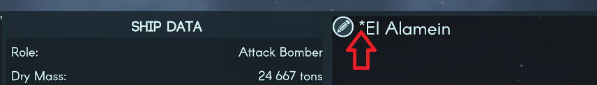

# Preserving mod state over save/load

## Version compatibility

Tested on 0.3.28

## Motivation

Mod makers may want to introduce state that needs to be preserved over
save/load. Examples of that may include tracking some modded state of objects
that are not contained in vanilla data structures - say a mod may add tracking
of amount of combats a particular ship partook in. We will follow that idea as an example.

## Background

`TIGameState` class represents saveable entities in the game. All objects that
preserve the state over save/load inherit the class.

`GameStateManager` is a centralized tracker of the state. You can use
`GameStateManager.CreateNewGameState<*state type*>()` to manually register state
with the manager. At the time of save, the manager goes over the list of all
registered objects and serializes them to the json file alongside with the
associated in-game type. It also preserves cross-object references in the saved
objects using the IDs of them.

On-load, the manager iterates over the serialized objects in the loaded save
file, deserializes them in order, and calls initialization functions on the
objects. There are total 7 initialization stages:

* PostGameStateCreateInit_OnCreationOnly_1
* PostGlobalGameStateCreateInit_2
* PostCanvasManagerCreateInit_3
* PostInitializationInit_4
* PostAllStartUpInit_5
* PostVisualizerCreationInit_6
* PostVisualizerCreationInit_7

One can not extend an existing state object, and thus is required to define a
new one as well as keep track of the state for the purpose of keeping up to the
intended state. The newly created state needs to inherit `TIGameState` as well
as override at least on of the aforementioned initialization functions. Unless
in special circumstances, you likely need to override either
`PostInitializationInit_4` or `PostAllStartUpInit_5` (in most cases there is no
practical difference between them, so you can choose either).

Once the object is no longer required to be preserved across save/load, you
should remove it from the state manager with
`GameStateManager.RemoveGameState<*state type*>(*stateID*, false)`.

If you want to attach extra state to an existing entity, you need to separately
track mapping between the original entity and the extra state. To avoid
unintentionally leaking the extra state across save/load you should clean up the
state in prefix patches of `SolarSystemBootstrap.LoadGame` and
`ViewControl.ClearGameData`.

## A note on save compatibility

Your mod should not see any issues with compatibility with existing saves as
long as your mod can generate a default extra state for existing objects first
time it is requested (see the manager's mapping accessor in the example below).
However, removing the mod that generates the extra state will cause crash when
attempting to load a save referencing the state from the removed mod.

## Recipe

* Create a custom state class inhereting TIGameState. The class should contain
  a reference to the object you extend (if any), and you custom state. Public
  fields of the class are serializable to the save state by default. Private
  fields require `[SerializeField]` annotation.

```C#
    class TISpaceShipVeterancyState : TIGameState {
        // Override the ship reference field to allow setting a cross-reference on the field.
        // Since we attach the veterancy status to the the specific ship, we have to keep track
        // of the object we extend the state of.
        new public TISpaceShipState ref_ship;

        [SerializeField]
        public int battlesSurvived { get; private set; } = 0;

        public void RecordBattle() {
            battlesSurvived += 1;
        }

        // Initialized function since we can't have constructors for TIGameState objects.
        public void InitWithSpaceShipState(TISpaceShipState ship) {
            if (ship.template == null) {
                return;
            }
            this.ref_ship = ship;
        }

        // On load - restore the state to the manager. See below the definition of the manager.
        public override void PostInitializationInit_4() {
            SpaceShipVeterancyManager.singleton.RegisterShip(this.ref_ship, this);
        }
    }
```

* Create a manager to map the state to the object it is attached to. The manager
  should keep a mapping between the original object's ID and its extension.

```C#
    class SpaceShipVeterancyManager {

        // Create a global manager object for the state tracking.
        public static SpaceShipVeterancyManager singleton = new SpaceShipVeterancyManager();

        // Mapping between ID of the `TISpaceShipState` and associated `TISpaceShipVeterancyState`.
        private Dictionary<GameStateID, TISpaceShipVeterancyState> 
            SpaceShipVeterancyStateMapping =
            new Dictionary<GameStateID, TISpaceShipVeterancyState>();

        // Accessor to the above mapping.
        public TISpaceShipVeterancyState this[TISpaceShipState ship] {
            get { 
                if (ship == null) {
                    return null;
                }

                // To avoid crashing - register the new state extension with defaults.
                if (!SpaceShipVeterancyStateMapping.ContainsKey(ship.ID)) {
                    this.RegisterShip(ship);
                }

                return SpaceShipVeterancyStateMapping[ship.ID];
            }
        }

        // Add new extra state to an existing object.
        public void RegisterShip(TISpaceShipState ship, TISpaceShipVeterancyState veterancy = null) {
            if (SpaceShipVeterancyStateMapping.ContainsKey(ship.ID)) {
                return;
            }

            if (veterancy == null) {
                // Create the object within the state manager.
                veterancy = GameStateManager.CreateNewGameState<TISpaceShipVeterancyState>();
                // And initialize it with defaults
                veterancy.InitWithSpaceShipState(ship);
            }

            SpaceShipVeterancyStateMapping.Add(ship.ID, veterancy);
        }

        // Remove the extra state from an existing object.
        public void UnregisterShip(TISpaceShipState ship) {
            if (!SpaceShipVeterancyStateMapping.ContainsKey(ship.ID)) {
                TISpaceShipVeterancyState shipVeterancyState = this[ship];
                if (GameStateManager.RemoveGameState<TISpaceShipVeterancyState>(shipVeterancyState.ID, false)) {
                    SpaceShipVeterancyStateMapping.Remove(ship.ID);
                }
            }
        }

        // Clear up mapping
        public void ResetState() {
            SpaceShipVeterancyStateMapping.Clear();
        }
    }
```

* Patch in `SolarSystemBootstrap.LoadGame` and `ViewControl.ClearGameData` to
  clear up the manager's state to ensure no unintentional leakage of the state
  across save/load.

```C#
    [HarmonyPatch(typeof(SolarSystemBootstrap), "LoadGame")]
    static class LoadGamePatch {
        static void Prefix() {
            SpaceShipVeterancyManager.singleton.ResetState();
        }
    }

    [HarmonyPatch(typeof(ViewControl), "ClearGameData")]
    static class ClearGameDataPatch {
        static void Prefix() {
            SpaceShipVeterancyManager.singleton.ResetState();
        }
    }
```

* Patch in the `<original state type>.InitWithTemplate` to initialize and
  register the state extension for the newly created object.

```C#
    [HarmonyPatch(typeof(TISpaceShipState), "InitWithTemplate")]
    static class InitWithTemplatePatch {
        // In this case the argument is `rawTemplate`, but in others it might be
        // just `template`.
        static void Postfix(TIDataTemplate rawTemplate, TISpaceShipState __instance) {
            if (rawTemplate as TISpaceShipTemplate != null) {
                SpaceShipVeterancyManager.singleton.RegisterShip(__instance);
            }
        }
    }
```

* Patch in relevant methods to update the state of your extra state. In the case
  of tracking the combat state of the ship, we need to patch in
  `TISpaceShipState.DestroyShip` which is responsible for removing the destroyed
  ship from the active objects, and `TISpaceFleetState.PostCombat`, which is
  triggered when the combat is resolved (either manually or via auto resolve).

```C#
    [HarmonyPatch(typeof(TISpaceShipState), "DestroyShip")]
    static class DestroyShipPatch {
        static void Postfix(ref TISpaceShipState __instance) {
            SpaceShipVeterancyManager.singleton.UnregisterShip(__instance);
        }
    }

    [HarmonyPatch(typeof(TISpaceFleetState), "PostCombat")]
    static class PostCombatPatch {
        static void Postfix(ref TISpaceFleetState __instance) {
            foreach (var ship in __instance.ships) {
                if (!ship.ShipDestroyed()) {
                    SpaceShipVeterancyManager.singleton[ship].RecordBattle();
                }
            }
        }
    }
```

* In the case of the specific example, we also want to see the registered state
  somewhere. Add some simple visual inidication for the battle proven ships.

```C#
    [HarmonyPatch(typeof(FleetsScreenController), "UpdateIndividualDataScreen")]
    static class PatchUpdateIndividualDataScreen {
        static void Postfix(ref FleetsScreenController __instance) {
            if (SpaceShipVeterancyManager.singleton[__instance.selectedShip].battlesSurvived > 0) {
                __instance.indiv_ShipName.SetText("*" + __instance.selectedShip.displayName, true);
            }
        }
    }


    [HarmonyPatch(typeof(FleetsScreenController), "OnClickSaveName")]
    static class PatchOnClickSaveName {
        static void Postfix(ref FleetsScreenController __instance) {
            if (SpaceShipVeterancyManager.singleton[__instance.selectedShip].battlesSurvived > 0) {
                __instance.indiv_ShipName.SetText("*" + __instance.selectedShip.displayName, true);
            }
        }
    }
```

### Result

Nice little indicator of battle hardened ships :)



### Complete Example

* [Mod entry point](src/SaveStateExample.cs)
* [Object state file](src/TISpaceShipVeterancyState.cs)
* [Custom state manager](src/SpaceShipVeterancyManager.cs)
* [Harmony patches](src/SpaceShipStatePatches.cs)
