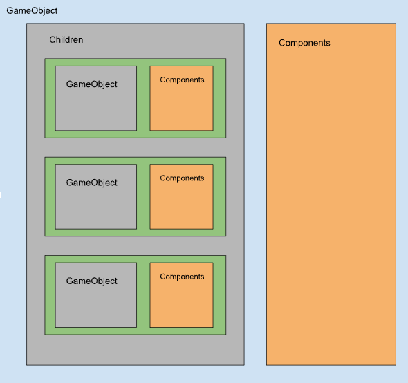
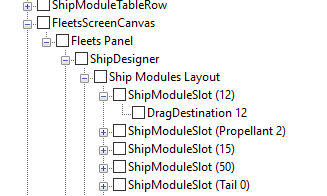
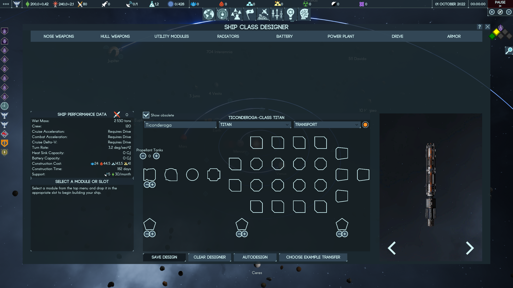

# Intro to unity UI

## Unity Object Tree



Unity scenes constitutes a tree (or rather a forest) of objects. The nodes in the tree are `GameObject` entities, which in a sense define what the object is. Each `GameObject` has at most one parent object (root objects do not have parent), and any number (including none) of children `GameObject`. The relations between the objects are organised via `Transform`. Each `GameObject` has an attached `Transform` that can be accessed via `GameObject.transform`.

`GameObject` can have one or more `Component` attached to it. `Component` in general define aspects of `GameObject`, e.g. how it is presented, what it is doing and how it is doing it, how it reacts to external events.

One way to create a `GameObject` is to directly call a constructor and manually set up all of its parameters. `GameObject` can also be packaged and loaded from an AssetBundle (including storing all its configuration and attached components alongside). The third option is to use static method `GameObject.Instantiate` to clone an existing object or prefab template - it will also deep-copy all children objects and components.

## Extending UI with code by example

Unity UI is built out of `GameObject` entities described above. One can add and modify the objects it UI tree to alter its presentation. As an example, we will be adding an ability to have more slots for fitting a Titan.

The layout of each hull type is defined in `TIShipHullTemplate.json`, specifically `shipModelSlots` defines which slots the ship has, where they are displayed and what type of modules they can fit.

```json
   "shipModuleSlots": [
      {
         "moduleSlotType": "Drive",
         "x": 0,
         "y": 3
      },
```

If we want add an extra column of modules to Titan, a straightforward thing to do would be just copy the last column of objects before the nose weapon slots, increment their X parameter, and do the same increment for the nose weapon items (also don't forget to update `hullHardpoints` and `internalModules` to represent the new amount of slots) . However, that would make the right most nose slot at the `x == 10`, and an attempt to put a module in it will crash the game.

The reason for that is the UI representation, which has a fixed width grid of 10 (practically it also limits amount of rows to 8). To increase the grid size, let's look into the structure of the specific UI. Using `AssetStudioGUI` we can inspect the structure of the `ui` asset bundle. In the scene view we can see the following



We see that `ShipDesigner` object has `Ship Module Layout` child (it has more, which are not show on the picture), which in its own turn has a number of `ShipModuleSlots` objects as children, which contain `DragDestination` object. Note, those are not the names of types of the objects in the code, but some random names of objects, assigned by developers.

From that we can conclude, that `Ship Module Layout` is a container for UI elements representing slots. The next problem is to find in-code classes which are associated with the behaviour of the objects. This is, unfortunately, not always trivial because the `AssetStuidoGUI` doesn't show the attached components to the objects in an easy way, so mapping those requires a bit of investigation. In this case, searching for `ShipModuleSlotType` gets us to `ShipModuleDragDestination`. There we can see that it retains a reference to something called `FleetScreensController` - sounds like we are in the right spot!

Now, we want to understand what exactly constitutes the objects in the branch, thus we highjack a random method, and add some traversal/console printing to investigate (there are generic tools for investigating the object trees within the game, but at the time of writing this page the author has not tried or learnt how to use them, thus, old school debug printing :) )

```C#
    [HarmonyPatch(typeof(ShipModuleDragDestination), "Awake")]
    static class ShipModuleDragDestination_Awake_Patch {
        static void Postfix(ShipModuleDragDestination __instance) {
            GameObject traverse = __instance.transform.gameObject;

            while (traverse != null) {
                Log.Debug("OBJECT: " + traverse.name);
                foreach (var c in traverse.GetComponents<Component>()) {
                    Log.Debug("    Component: " + c.ToString());
                }
                traverse = traverse?.transform?.parent?.gameObject;
            }
        }
    }
```

Here is the output you will see in the `Player.log` (truncated to what we care about)

```
OBJECT: DragDestination
    Component: DragDestination (UnityEngine.RectTransform)
    Component: DragDestination (PavonisInteractive.TerraInvicta.UI.ShipModuleDragDestination)
    Component: DragDestination (UnityEngine.CanvasRenderer)
    Component: DragDestination (UnityEngine.UI.Image)
    Component: DragDestination (ModelShark.TooltipTrigger)
    Component: DragDestination (UnityEngine.UI.Button)
OBJECT: ShipModuleSlot (Propellant 0)
    Component: ShipModuleSlot (Propellant 0) (UnityEngine.RectTransform)
OBJECT: Ship Modules Layout
    Component: Ship Modules Layout (UnityEngine.RectTransform)
    Component: Ship Modules Layout (UnityEngine.CanvasRenderer)
    Component: Ship Modules Layout (UnityEngine.UI.GridLayoutGroup)
...
```

From there we can see the `Ship Modules Layout` has `UnityEngine.UI.GridLayoutGroup` - a `Component` that will organise childrens of the `GameObject` it is attached to in a rectangular grid. Digging around we will find out that it has exactly 80 children, and `constraintCount` equal to 10 (meaning, fixed width 10 - 10x8 lattice). To add a possibility for a new column, we would need to

* change `constraintCount` to 11 (adding 1 row)
* add more `ShipModuleSlot` children
* organise the children in such a way that the grid correctly display the extra row
* * Just doing first three steps will break the layout because be default the display order is the order in which the children were added, meaning if we just add more children, things will get offset in the physical layout.

In order to add those extra children in-time, we need to find a convenient place, and `FleetsScreenController.InitializeShipDesigner` - the initialization point for the ship builder - is the perfect spot for us to high jack.

* First, we postfix patch the method

```C#
    [HarmonyPatch(typeof(FleetsScreenController), "InitializeShipDesigner")]
    static class FleetsScreenController_InitializeShipDesigner_Patch {
        static void Postfix(FleetsScreenController __instance) {
        }
    }
```

* We need to grab a few controller specific data structures which we need to be updating so the controller knows it needs to deal with more objects now. Also we create a few temprorary array for using later.

```C#
            ShipModuleDragDestination[] origSlots =
                __instance
                .GetType()
                .GetField("moduleDragDestinations", BindingFlags.NonPublic | BindingFlags.Instance)
                .GetValue(__instance) as ShipModuleDragDestination[];
            ShipModuleDragDestination[] newSlots = new ShipModuleDragDestination[] { };
            ShipModuleDragDestination[] allSlots = new ShipModuleDragDestination[] { };

            Dictionary<Vector2Int, ShipModuleDragDestination> dict =
                __instance
                .GetType()
                .GetField("shipModuleSlotDictionary", BindingFlags.NonPublic | BindingFlags.Instance)
                .GetValue(__instance) as Dictionary<Vector2Int, ShipModuleDragDestination>;
```

* We are lazy people, so instead of manually recreating require structure of objects and components for a new slot, we will be cloning existing ones. Thus, find a candidate for cloning

```C#
            GameObject proto =
                __instance.GetComponentInChildren<ShipModuleDragDestination>().transform.parent.gameObject;
```

* While we are here, let's set the new grid width

```C#
            var grid = proto.GetComponentInParent<GridLayoutGroup>();
            grid.constraintCount = 11;
```

* Now lets create a bunch of new slots by instantiating an existing one

```C#
            for (int i = 0; i < 8; i++) {
                var clone = GameObject.Instantiate(proto, proto.transform.parent);
                var dest = clone.GetComponentInChildren<ShipModuleDragDestination>();
                dest.iconSize = 50;
                dest.SetControllerBase(__instance);
                dest.transform.localPosition = dest.defaultPosition;
                // keep track of the new objects we are creating - we will need to do
                // some merging with the existing list in a particular order.
                newSlots = newSlots.AddToArray(dest);

                // some bookkeeping for the specific controller
                dict.Add(new Vector2Int(10, i), dest);
            }
```

* We want to order the children so we don't have a layout shift. We need to `SetSiblingIndex` in the right order, so we first merge new objects with the original one, by injecting a new object after every 10th existing.

```C#
            for (int i = 0; i < origSlots.Length; i++) {
                allSlots = allSlots.AddToArray(origSlots[i]);
                if (i % 10 == 9) {
                    allSlots = allSlots.AddToArray(newSlots[i / 10]);
                }
            }
            for (int i = 0; i < allSlots.Length; ++i) {
                allSlots[i].iconSize = 50; // scale icons size down a notch so they fit easier
                allSlots[i].transform.parent.SetSiblingIndex(i);
            }
```

* Final bookkeeping, since the controller for this UI needs to have a list of all children objects explicitly - update it

```C#
            __instance
                .GetType()
                .GetField("moduleDragDestinations", BindingFlags.NonPublic | BindingFlags.Instance)
                .SetValue(__instance, allSlots);
```

<details> <summary> Full Code </summary>

```C#
using System.Reflection;
using System.Collections.Generic;
using HarmonyLib;

using UnityEngine;
using UnityEngine.UI;
using PavonisInteractive.TerraInvicta;
using PavonisInteractive.TerraInvicta.UI;


namespace TestUIMod {
    [HarmonyPatch(typeof(FleetsScreenController), "InitializeShipDesigner")]
    static class FleetsScreenController_InitializeShipDesigner_Patch {
        static void Postfix(FleetsScreenController __instance) {
            ShipModuleDragDestination[] origSlots =
                __instance
                .GetType()
                .GetField("moduleDragDestinations", BindingFlags.NonPublic | BindingFlags.Instance)
                .GetValue(__instance) as ShipModuleDragDestination[];
            ShipModuleDragDestination[] newSlots = new ShipModuleDragDestination[] { };
            ShipModuleDragDestination[] allSlots = new ShipModuleDragDestination[] { };

            Dictionary<Vector2Int, ShipModuleDragDestination> dict =
                __instance
                .GetType()
                .GetField("shipModuleSlotDictionary", BindingFlags.NonPublic | BindingFlags.Instance)
                .GetValue(__instance) as Dictionary<Vector2Int, ShipModuleDragDestination>;

            GameObject proto =
                __instance.GetComponentInChildren<ShipModuleDragDestination>().transform.parent.gameObject;

            var grid = proto.GetComponentInParent<GridLayoutGroup>();
            grid.constraintCount = 11;

            for (int i = 0; i < 8; i++) {
                var clone = GameObject.Instantiate(proto, proto.transform.parent);
                var dest = clone.GetComponentInChildren<ShipModuleDragDestination>();
                dest.iconSize = 50;
                dest.SetControllerBase(__instance);
                dest.transform.localPosition = dest.defaultPosition;
                newSlots = newSlots.AddToArray(dest);
                dict.Add(new Vector2Int(10, i), dest);
            }
            for (int i = 0; i < origSlots.Length; i++) {
                allSlots = allSlots.AddToArray(origSlots[i]);
                if (i % 10 == 9) {
                    allSlots = allSlots.AddToArray(newSlots[i / 10]);
                }
            }
            for (int i = 0; i < allSlots.Length; ++i) {
                allSlots[i].iconSize = 50;
                allSlots[i].transform.parent.SetSiblingIndex(i);
            }
            __instance
                .GetType()
                .GetField("moduleDragDestinations", BindingFlags.NonPublic | BindingFlags.Instance)
                .SetValue(__instance, allSlots);
        }
    }
}
```
</details>

### Result

Now we can modify the titan layout to include an extra column of modules
<details>
<summary> Updated titan template JSON </summary>

```json
 {
   "dataName": "Titan",
   "friendlyName": "Titan",
   "noseHardpoints": 4,
   "hullHardpoints": 8,
   "internalModules": 10,
   "length_m": 300,
   "toylength_cm": 17.3,
   "width_m": 35,
   "volume": 264581,
   "thrusterMultiplier": 1,
   "structuralIntegrity": 36,
   "mass_tons": 2050,
   "crew": 120,
   "alien": false,
   "monthlyIncome_Money": -30,
   "missionControl": 5,
   "shipyardyOffset": [
      0,
      0,
      0
   ],
   "modelResource": [
      "ships/Titan",
      "ships/Titan_1"
   ],
   "combatUIpath": [
      "ui_spacecombat/OBJ_battle_earth_TI",
      "ui_spacecombat/OBJ_battle_earth_TI_ALT"
   ],
   "path1": [
      "earth_TI/",
      "earth_TI_ALT/"
   ],
   "path2": [
      "OBJ_battle_earth_TI",
      "OBJ_battle_earth_TI_ALT"
   ],
   "requiredProjectName": "Project_Titans",
   "weightedBuildMaterials": {
      "volatiles": 0.1,
      "metals": 0.7,
      "nobleMetals": 0.2,
      "exotics": null
   },
   "baseConstructionTime_days": 240,
   "shipModuleSlots": [
      {
         "moduleSlotType": "Drive",
         "x": 0,
         "y": 3
      },
      {
         "moduleSlotType": "PowerPlant",
         "x": 1,
         "y": 3
      },
      {
         "moduleSlotType": "Battery",
         "x": 2,
         "y": 3
      },
      {
         "moduleSlotType": "Radiator",
         "x": 3,
         "y": 3
      },
      {
         "moduleSlotType": "TailArmor",
         "x": 0,
         "y": 7
      },
      {
         "moduleSlotType": "LateralArmor",
         "x": 4,
         "y": 7
      },
      {
         "moduleSlotType": "NoseArmor",
         "x": 9,
         "y": 7
      },
      {
         "moduleSlotType": "NoseHardPoint",
         "x": 10,
         "y": 3
      },
      {
         "moduleSlotType": "NoseHardPoint",
         "x": 9,
         "y": 1
      },
      {
         "moduleSlotType": "NoseHardPoint",
         "x": 9,
         "y": 3
      },
      {
         "moduleSlotType": "NoseHardPoint",
         "x": 9,
         "y": 5
      },
      {
         "moduleSlotType": "Utility",
         "x": 7,
         "y": 0
      },
      {
         "moduleSlotType": "HullHardPoint",
         "x": 7,
         "y": 2
      },
      {
         "moduleSlotType": "HullHardPoint",
         "x": 7,
         "y": 4
      },
      {
         "moduleSlotType": "Utility",
         "x": 7,
         "y": 6
      },
      {
         "moduleSlotType": "Utility",
         "x": 6,
         "y": 0
      },
      {
         "moduleSlotType": "HullHardPoint",
         "x": 6,
         "y": 2
      },
      {
         "moduleSlotType": "HullHardPoint",
         "x": 6,
         "y": 4
      },
      {
         "moduleSlotType": "Utility",
         "x": 6,
         "y": 6
      },
      {
         "moduleSlotType": "Utility",
         "x": 5,
         "y": 0
      },
      {
         "moduleSlotType": "HullHardPoint",
         "x": 5,
         "y": 2
      },
      {
         "moduleSlotType": "HullHardPoint",
         "x": 5,
         "y": 4
      },
      {
         "moduleSlotType": "Utility",
         "x": 5,
         "y": 6
      },
      {
         "moduleSlotType": "Utility",
         "x": 4,
         "y": 2
      },
      {
         "moduleSlotType": "Utility",
         "x": 4,
         "y": 4
      },
      {
         "moduleSlotType": "Propellant",
         "x": 0,
         "y": 0
      },
      {
         "moduleSlotType": "Utility",
         "x": 8,
         "y": 0
      },
      {
         "moduleSlotType": "HullHardPoint",
         "x": 8,
         "y": 2
      },
      {
         "moduleSlotType": "HullHardPoint",
         "x": 8,
         "y": 4
      },
      {
         "moduleSlotType": "Utility",
         "x": 8,
         "y": 6
      },
      {
         "moduleSlotType": "",
         "x": null,
         "y": null
      },
      {
         "moduleSlotType": "",
         "x": null,
         "y": null
      }
   ]
},
```

</details>


